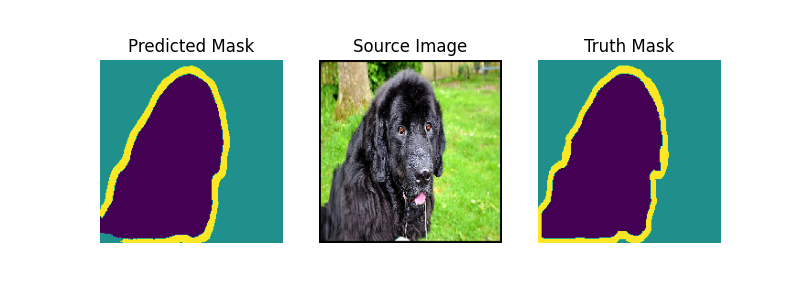
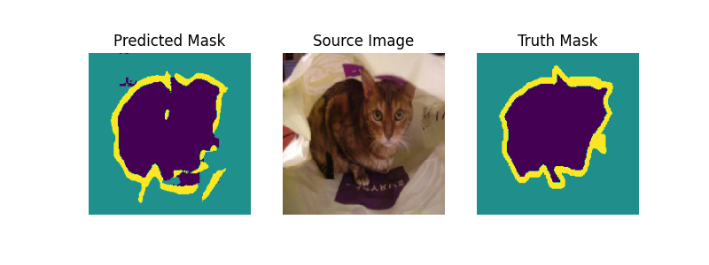

# cv-segmentation-pets

This repository contains code for training and evaluating a convolutional neural network (CNN) for image segmentation on the Oxford-IIIT Pet Dataset. The dataset consists of images of 37 different breeds of cats and dogs, with pixel-level annotations for segmentation.

## Setup

### Prerequisites

- Python 3.11.0
- see more in `requirements.txt`

### Sample Results

Below are some sample results from the model:




### Installation

1. Clone the repository:
```sh
git clone https://github.com/henrym105/cv-segmentation-pets.git
cd cv-segmentation-pets
```

2. Install the required packages:
```sh
python -m venv venv
source venv/bin/activate
pip install -r requirements.txt
```

3. Download the Oxford-IIIT Pet Dataset and place the images in the `images/` directory and the annotations in the `annotations/trimaps/` directory.

## Usage

### Training

To train the model, run the following command:
```sh
python main.py
```

### Testing

To test the model, run the following command:
```sh
python test.py
```

# Dataset

To download the dataset: 
```sh
wget http://www.robots.ox.ac.uk/~vgg/data/pets/data/images.tar.gz
wget http://www.robots.ox.ac.uk/~vgg/data/pets/data/annotations.tar.gz
tar -xf images.tar.gz
tar -xf annotations.tar.gz
```

The Oxford-IIIT Pet Dataset is a 37-category pet dataset with roughly 200 images for each class. The images have large variations in scale, pose, and lighting. All images have associated ground truth annotations of breed, head ROI, and pixel-level trimap segmentation.

### Contents

- `trimaps/`: Trimap annotations for every image in the dataset. Pixel Annotations: 1: Foreground, 2: Background, 3: Not classified.
- `xmls/`: Head bounding box annotations in PASCAL VOC Format.
- `list.txt`: Combined list of all images in the dataset. Each entry in the file is of the following nature: `Image CLASS-ID SPECIES BREED ID`.
- `trainval.txt`: Files describing splits used in the paper.

## Model

The model architecture is defined in `model.py`. It uses a convolutional neural network (CNN) for image segmentation. The model can be trained from scratch or loaded from a pre-trained checkpoint.

## Results

Training and validation loss plots are saved as `training_validation_loss.png` in the results directory.

## License

This project is licensed under the MIT License - see the [LICENSE](LICENSE) file for details.